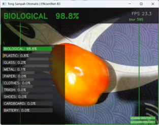
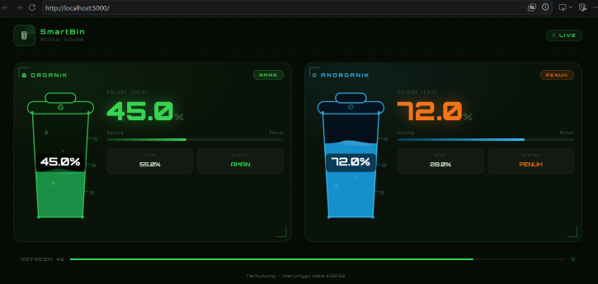
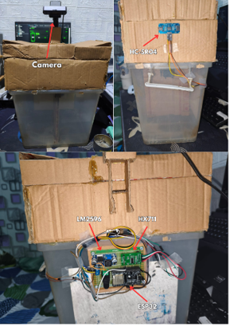
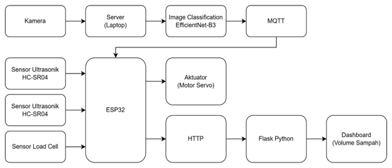
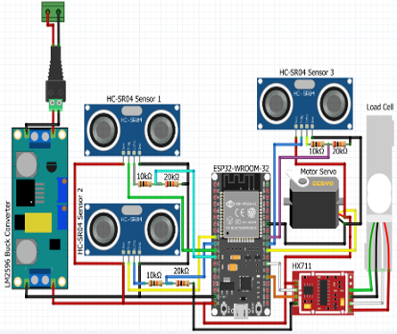
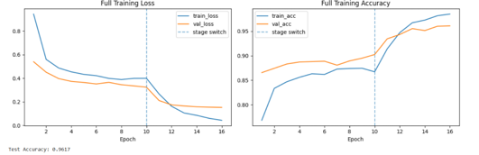
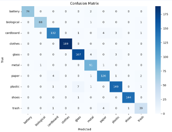

# 🗑️ Smart Trash Bin — Automatic Waste Sorting with Image Classification

An automatic smart trash bin that classifies waste type (organic/inorganic, etc.) in real time using **EfficientNet-B3**, then drives a servo motor to open the correct compartment lid. The system also monitors bin fill levels and displays them on a live web dashboard.

## 📸 Demo

**Real-time inference (running on PC):**



**Web Dashboard (bin volume monitoring):**



**Physical hardware implementation:**



## ✨ Features

- Real-time waste classification from a camera feed using **EfficientNet-B3** (PyTorch)
- Automatic object presence detection (background subtraction, no manual trigger needed)
- Motion blur filtering so blurry frames are skipped during classification
- Weighted confidence voting across multiple frames for stable, reliable predictions
- Communication between the PC (inference) and ESP32 (actuator) via **MQTT**
- ESP32 drives a **servo motor** to open the lid matching the predicted class
- Bin fill-level monitoring (ultrasonic + load cell sensors) via a **live web dashboard (Flask)**

## 🏗️ System Architecture



**Flow overview:**
1. The ESP32 continuously reads its ultrasonic and load cell sensors and detects when an object is placed in front of the bin, then publishes a request over MQTT.
2. `vision/inference.py` running on the PC/laptop captures frames from the camera, detects object presence, and classifies the waste using EfficientNet-B3.
3. The classification result is published back to the ESP32 via MQTT.
4. The ESP32 moves the servo motor to open the lid corresponding to the predicted class.
5. Bin volume data (organic/inorganic) is sent from the ESP32 to the Flask server over HTTP and displayed live on the web dashboard.

## 📁 Folder Structure

```
smart-trash-bin/
├── README.md
├── requirements.txt
├── .gitignore
├── LICENSE
├── firmware/
│   └── smart-trash-bin-esp32.ino     # ESP32 code (sensors, servo, MQTT, state machine)
├── vision/
│   └── inference.py           # Real-time inference + MQTT publisher (runs on PC)
├── server/
│   └── app.py                        # Flask web server for the volume monitoring dashboard
├── models/
│   └── garbage_classifier_best.pt    # Trained model checkpoint (EfficientNet-B3)
└── docs/
    ├── block-diagram.png
    ├── wiring-diagram.png
    ├── hardware-implementation.png
    ├── inference.png
    ├── dashboard.png
    ├── confusion-matrix.png
    └── training-loss-accuracy.png
```

## 🛠️ Hardware Used

- ESP32 (dev board)
- 1x Servo motor (opens/closes the bin lid)
- 3x HC-SR04 ultrasonic sensors (object presence detection + bin volume level)
- Load cell + HX711 module (weight measurement)
- LM2596 buck converter (power regulation)
- Camera (webcam / USB camera connected to the PC)

**Wiring diagram:**



## 💻 Software / Libraries

**On the ESP32 (Arduino IDE):**
- `WiFi.h`
- `PubSubClient` by Nick O'Leary
- `ESP32Servo` by Kevin Harrington

**On the PC (Python):**
See `requirements.txt`:
```
torch==2.4.1
torchvision==0.19.1
numpy==1.26.4
opencv-python==4.8.1.78
paho-mqtt
flask
```

## 🚀 Getting Started

### 1. Set up an MQTT broker
Install an MQTT broker (e.g. [Mosquitto](https://mosquitto.org/)) on a PC/server that is on the same network as the ESP32. Setup mosquitto.conf as below
```
listener 1883
allow_anonymous true
```

### 2. ESP32 Firmware
1. Open `firmware/smart-trash-bin-esp32.ino` in the Arduino IDE.
2. Install the required libraries: `PubSubClient`, `ESP32Servo`.
3. **Update the WiFi credentials, MQTT broker IP, and Flask server IP** to match your own network (see the ⚠️ Configuration section below).
4. Upload the sketch to your ESP32 board.

### 3. Vision / Inference (PC)
```bash
python -m venv .venv
.venv\Scripts\Activate.ps1
pip install -r requirements.txt
python vision/inference.py --model garbage_classifier_best.pt --absence-timeout 0.8 --conf 0.6 --roi 1 --smooth 20 --warmup 0.5 --min-stable 14 --blur-threshold 10 --camera 1
```

### 4. Flask Dashboard (PC)
```bash
python server/app.py
```
Open `http://<PC_IP>:5000` in your browser to view the live monitoring dashboard.

## 🧠 Model & Training Results

- Architecture: **EfficientNet-B3** (transfer learning, torchvision)
- Checkpoint format: `.pt` (contains `state_dict` + `class_names`)
- **Test Accuracy: 96.17%**

**Training loss & accuracy curves:**



**Confusion matrix (test set):**



## 🏷️ Waste Classes

The model classifies waste into the following categories:
`battery`, `biological`, `cardboard`, `clothes`, `glass`, `metal`, `paper`, `plastic`, `shoes`, `trash`

## 📄 License

See the [LICENSE](LICENSE) file for details.

## 🙋 Contributors

- Your Name — [GitHub](https://github.com/Yunachz)
